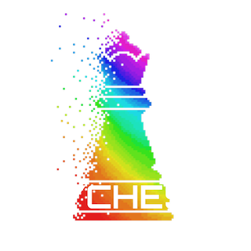

# PYCHESS
Un jeu d'échecs en Python conçu avec Pygame.

## Requis pour jouer sans installer d'exécutables (si vous installez sur github)

- Python 3.7 + 

- Pygame 2.0 + 

---

# Installation

Vous avez 2 possibilités pour installer le jeu :

-  Télécharger le .zip sur ce Github : 
  
    - Pour jouer il faut alors aller dans TERMINAL(ou CMD/Powershell sur windows) => taper python3 partie.py

- Télécharger pour Windows (.exe), OSX (.app) et linux :
  
  - http://pychess.nous-2304.fr

Fait avec amour par Gaspard Quentin, Luka Equoy et Simon Bach dans le cadre du concours des trophées NSI édition 2022.

😃
